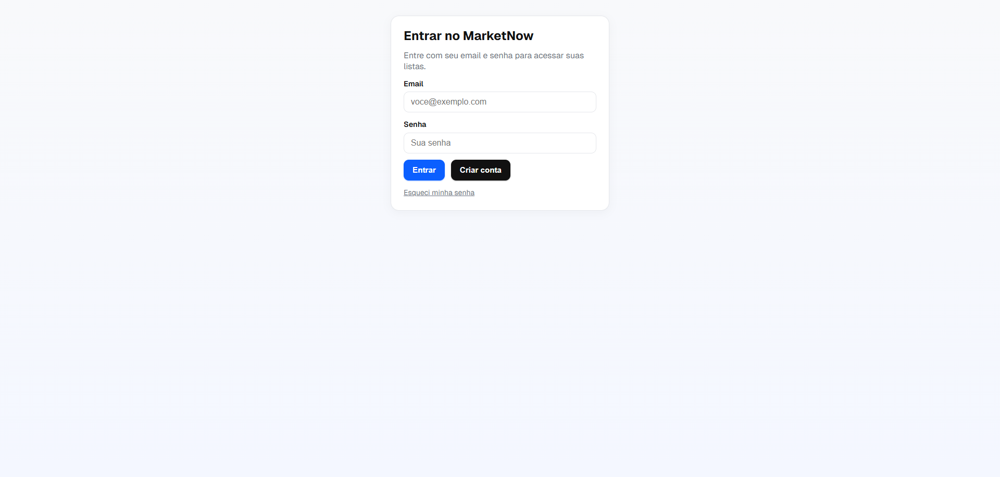
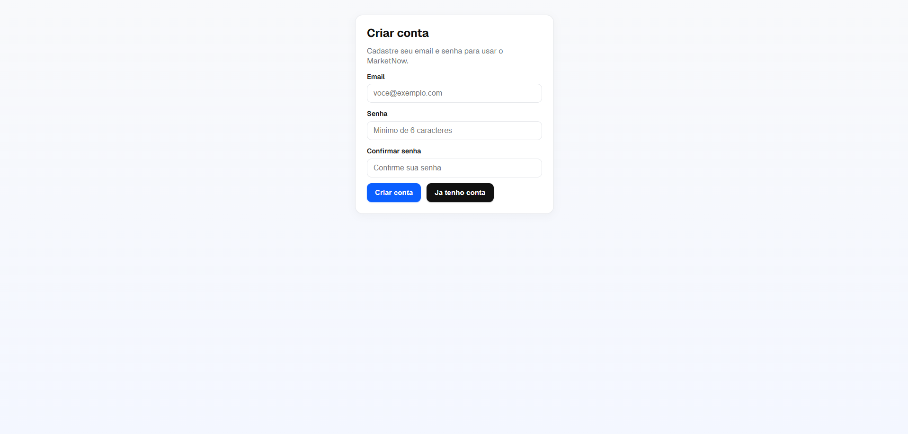
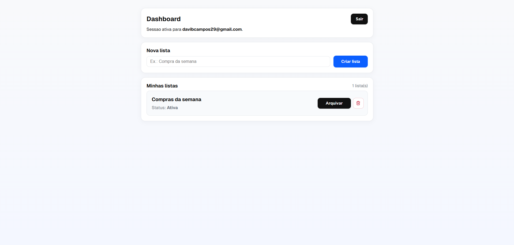
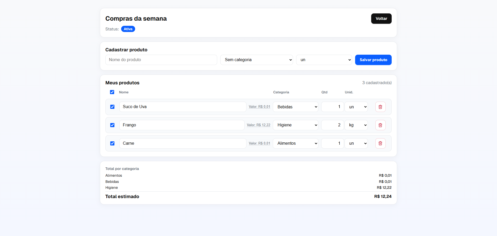

# MarketNow

Aplicação web para gerenciamento de listas de compras com autenticação por e-mail e senha, permitindo acompanhamento individual de produtos por usuário. O sistema oferece um fluxo direto e seguro de cadastro, login e recuperação de senha, com persistência de dados via Supabase.

## Aplicação em produção

- https://marketnow-davi.vercel.app/

## Stack

- Next.js
- React
- Supabase
- Vercel

## Funcionalidades implementadas

- Cadastro com e-mail e senha
- Login
- Redefinição de senha
- Proteção de rotas autenticadas
- Integração com banco via Supabase

## Screenshots






## Estrutura do projeto

- `src/app`: rotas e páginas (App Router)
- `src/components`: componentes reutilizáveis de UI
- `src/lib`: clientes/configuração de Supabase, validações e utilitários
- `src/services`: regras de serviço (ex.: precificação e formatação)
- `supabase`: schema, seed e migrations SQL
- `docs`: documentação técnica e operacional

## Como rodar localmente

```bash
git clone https://github.com/the-dv/marketnow.git
cd marketnow
npm install
npm run dev
```
